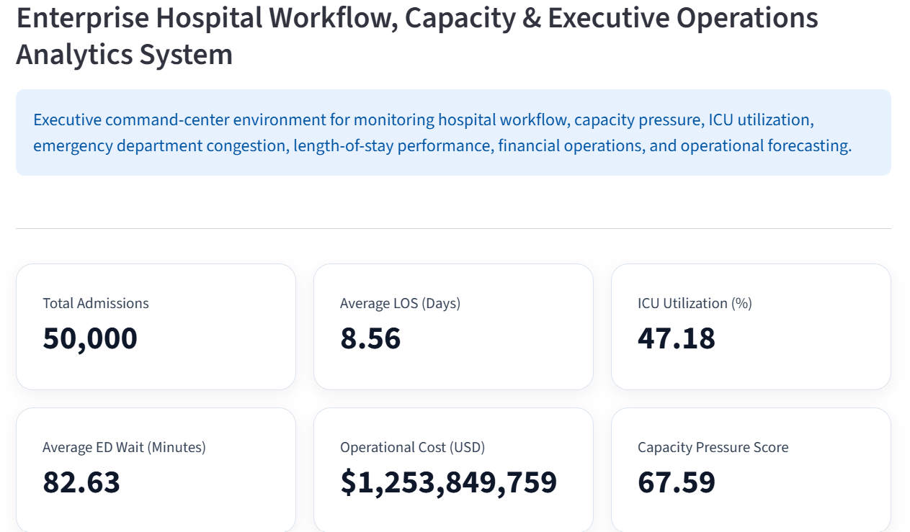
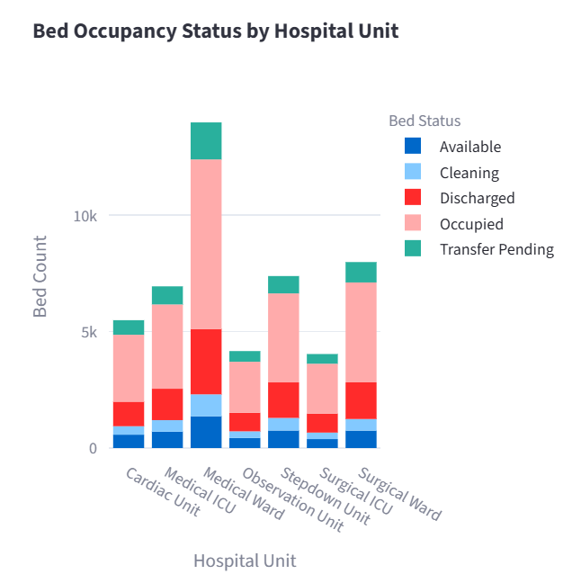
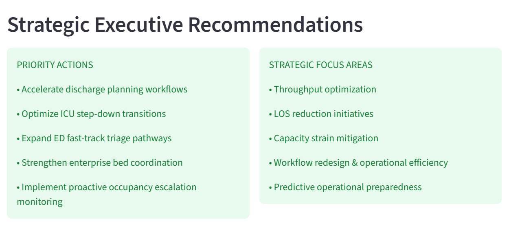

# # Enterprise Healthcare Operations Intelligence System


## Enterprise Hospital Workflow, Capacity & Executive Operations Analytics System

An enterprise-grade healthcare operations intelligence environment designed to support executive operational visibility, patient flow intelligence, hospital capacity monitoring, emergency department analytics, utilization management, operational forecasting, healthcare business intelligence, and strategic operational decision support.

---

# Launch Project 

🔗 **Live Executive Healthcare Operations Dashboard:**  
[Launch Live System](https://enterprise-healthcare-operations-intelligence-system-kxqd4qjp6.streamlit.app/)

# Executive Overview

The Enterprise Healthcare Operations Intelligence System is a deployable healthcare analytics and operational intelligence platform developed to provide executive-level visibility into hospital workflow, throughput efficiency, occupancy strain, ICU utilization, emergency department congestion, operational cost burden, and healthcare systems performance.

The platform integrates operational healthcare analytics, executive KPI monitoring, workflow intelligence, healthcare business intelligence, forecasting analytics, and strategic operational insights into a unified healthcare command-center environment.

---

# Operational Intelligence Highlights

- 50,000+ synthetic hospital operational encounters analyzed
- Enterprise multi-page healthcare operations intelligence architecture
- 7 dedicated executive operational intelligence modules
- Real-time operational KPI monitoring across workflow, occupancy, ICU utilization, LOS analytics, ED congestion, and healthcare finance
- Interactive enterprise healthcare command-center environment
- Dynamic operational filtering across hospital units, ICU status, occupancy status, LOS burden, and ED congestion
- SQL-powered operational analytics layer supporting executive healthcare reporting
- Executive operational alert engine for workflow strain and capacity intelligence
- Plotly-powered interactive healthcare business intelligence dashboards
- Deployable Streamlit-based enterprise healthcare operations intelligence system

---

# Strategic Objectives

This system was developed to support:

- hospital operations intelligence
- patient flow optimization
- throughput efficiency analytics
- occupancy & bed intelligence
- ICU operational visibility
- emergency department congestion monitoring
- LOS optimization analytics
- operational cost intelligence
- healthcare workflow analytics
- executive healthcare BI
- operational forecasting & preparedness
- strategic healthcare operations monitoring

---

# Enterprise Modules

## Executive Command Center
- enterprise operational overview
- executive KPI monitoring
- operational alert engine
- workflow intelligence visibility
- executive operational monitoring

## Patient Flow Intelligence
- patient throughput analytics
- transfer burden monitoring
- workflow movement visibility
- hospital unit intelligence

## Capacity & Bed Intelligence
- occupancy monitoring
- bed utilization analytics
- ICU capacity visibility
- operational strain intelligence

## Emergency Department Intelligence
- ED congestion analytics
- wait-time monitoring
- operational bottleneck visibility
- emergency workflow intelligence

## LOS & Utilization Analytics
- prolonged-stay burden monitoring
- throughput efficiency analytics
- utilization intelligence
- LOS operational visibility

## Financial & Operational Intelligence
- operational expenditure analytics
- resource utilization monitoring
- ICU cost burden visibility
- healthcare financial intelligence

## Forecasting & Predictive Operations
- operational forecasting
- projected capacity strain analytics
- predictive operational visibility
- executive preparedness intelligence

## Executive Insights & Recommendations
- real-time executive operational insights
- strategic healthcare recommendations
- operational risk signals
- enterprise operational status intelligence

---

# Real-Time Executive Insights & Recommendations

## Enterprise Operational Findings

### Elevated LOS Burden
- Average LOS: 8.56 days
- 28,107 prolonged-stay encounters identified
- ICU environments demonstrate highest LOS burden

### ED Congestion Pressure
- Average ED wait time: 82.63 minutes
- Maximum ED wait time exceeded 560 minutes
- 25,000+ high wait-time encounters detected

### Sustained Capacity Strain
- Enterprise capacity pressure score: 67.59
- ICU operational demand remains elevated
- Medical ICU and Surgical ICU demonstrate highest operational pressure

### High Operational Expenditure
- Total operational expenditure exceeded $1.25B
- ICU-intensive workflows identified as major cost drivers
- Prolonged utilization contributing to elevated operational burden

---

# Strategic Executive Recommendations

## Operational Priorities
- accelerate discharge planning workflows
- optimize ICU step-down transitions
- strengthen enterprise bed coordination
- reduce throughput bottlenecks
- improve operational escalation visibility

## Capacity Optimization
- proactive occupancy management
- predictive capacity monitoring
- ICU throughput optimization
- dynamic surge readiness planning

## Emergency Department Optimization
- fast-track triage pathway enhancement
- ED congestion reduction initiatives
- patient movement acceleration workflows

## Financial & Operational Efficiency
- LOS reduction initiatives
- operational efficiency optimization
- high-cost workflow analysis
- resource utilization improvement

---

# Technical Architecture

## Frontend
- Streamlit

## Backend Analytics
- Python
- Pandas
- NumPy

## Visualization
- Plotly Express

## SQL Analytics Layer
- operational KPI analytics
- LOS analytics
- occupancy intelligence
- healthcare operational reporting

---

# Operational Intelligence Features

- Executive KPI Monitoring
- Operational Alert Engine
- Interactive Enterprise Filters
- Capacity Intelligence
- ICU Monitoring
- ED Congestion Intelligence
- Workflow Analytics
- LOS Intelligence
- Financial Operations Analytics
- Operational Forecasting
- Executive Healthcare BI

---

# Interactive Enterprise Filtering

The system supports real-time operational filtering across:

- Hospital Units
- Bed Occupancy Status
- ICU Operational Status
- LOS Ranges
- ED Wait-Time Ranges

This enables dynamic executive operational exploration and healthcare workflow intelligence analysis.

---

# Dataset

This project utilizes a MIMIC-IV-inspired synthetic hospital operations dataset designed for:

- operational healthcare intelligence
- patient flow analytics
- occupancy monitoring
- ICU utilization analysis
- LOS intelligence
- ED congestion monitoring
- operational finance analytics
- healthcare workflow intelligence
- executive healthcare BI

---

# Enterprise System Design Philosophy

This system was intentionally designed to prioritize:

- operational healthcare intelligence
- executive healthcare BI
- healthcare systems thinking
- workflow-centered analytics
- enterprise operational visibility
- strategic healthcare operations monitoring

The project intentionally avoids excessive AI complexity in favor of operational maturity, executive intelligence, healthcare systems analytics, and deployable healthcare operational intelligence engineering.

---

# SQL Analytics Layer

Dedicated SQL operational analytics modules include:

- operational KPI analysis
- occupancy intelligence
- LOS analytics
- capacity monitoring
- healthcare operational reporting

---

# Project Structure

```text
enterprise-healthcare-operations-intelligence-system/

├── assets/
├── data/
├── documentation/
├── notebooks/
├── pages/
├── sql/
├── utils/
├── app.py
├── README.md
└── requirements.txt
```

# Deployment

This system is deployable via:
- Streamlit Community Cloud
- healthcare analytics demonstrations
- operational intelligence showcases
- executive healthcare BI environments
- digital health transformation portfolios
---

# The deployed enterprise platform provides:

- executive healthcare operations intelligence
- patient flow analytics
- occupancy & bed intelligence
- ICU operational visibility
- ED congestion analytics
- LOS & utilization intelligence
- operational forecasting
- executive insights & recommendations
- interactive operational filtering
- healthcare business intelligence dashboards
---

# System Screenshots

## Executive Command Center


## Capacity & Bed Intelligence


## Executive Insights & Recommendations


# Strategic Positioning

This project demonstrates capabilities in:

- Healthcare Operations Intelligence
- Executive Healthcare BI
- Healthcare Workflow Analytics
- Capacity & Throughput Intelligence
- Hospital Systems Intelligence
- Digital Health Transformation
- Operational Healthcare Analytics
- Enterprise Healthcare Analytics Engineering
- Deployable Healthcare Intelligence Systems

---

# Built & Deployed By

## Dr. Samuel Israel

Healthcare Data Scientist | Digital Health Transformation Specialist | Healthcare Operations Intelligence | Executive Healthcare BI | Healthcare AI & Predictive Analytics | ML Engineering & Deployable AI Systems | Clinical & Operational Intelligence Systems